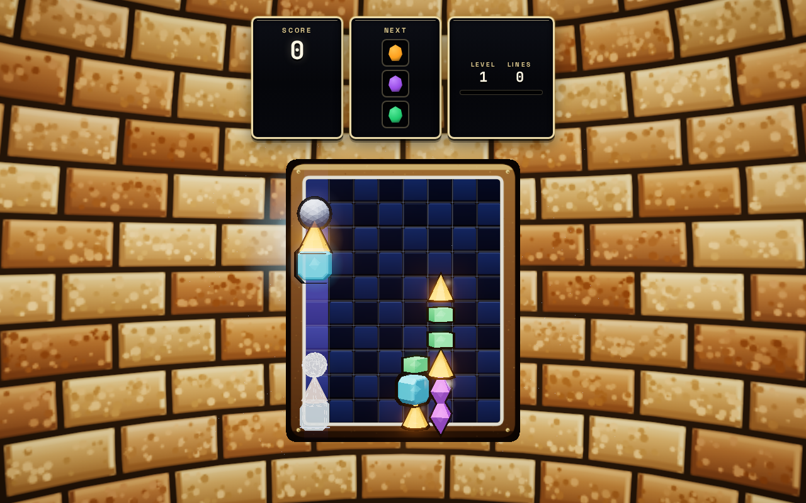
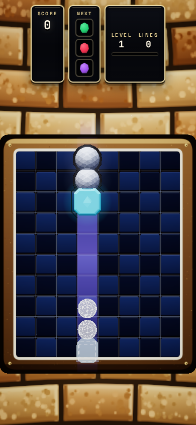

# Match-3D.js

> Um puzzle match-3 inspirado no clássico **COLUMNS** da Sega, elevado ao padrão
> visual dos jogos atuais — gráficos **AAA** com Three.js, jogável com **mouse ou
> teclado** (e touch no mobile).

<p align="center">
  <a href="https://fecolinhares.github.io/match-3djs/"></a>
  <a href="https://github.com/fecolinhares/match-3djs/actions"></a>
  <a href="LICENSE"></a>
</p>

<p align="center">
  
  
</p>

## 🎮 Jogar online

**https://fecolinhares.github.io/match-3djs/** — ou rode localmente (ver [Rodando](#-rodando)).

## 🎮 Como Jogar

O objetivo é alinhar **3 ou mais gems da mesma cor** — na horizontal, vertical
ou **diagonal** — para destruí-las e marcar pontos. Uma coluna de 3 gems cai do
topo; mova-a, rotacione as gems, e solte para alinhar e combinar.

| Ação | Teclado | Mouse |
|------|---------|-------|
| Mover coluna | `←` / `→` ou `A` / `D` | Clique na coluna |
| Rotacionar gems | `↑` ou `W` | Clique no tabuleiro |
| Queda rápida | `↓` ou `S` | — |
| Queda instantânea | `Espaço` | — |
| Pausar | `P` ou `Esc` | — |
| Reiniciar | `R` | Botão Play Again |

## ✨ Features

- **6 jóias em silhuetas únicas** — rubi hexagonal, safira square-cut,
  esmeralda step-cut, topázio pêra, amatista brilliant e esfera facetada,
  cada cor com sua forma (acessibilidade visual)
- **Estilo cartoon arcade** — gems flat com contorno ink escuro grosso,
  outlines que seguem cada silhueta
- **Fundo de pedra/tijolo** — parede de arcade cabinet desenhada em canvas
- **Ghost preview holograma** — formas reais da coluna em wireframe
  dashed branco mostram onde a peça vai pousar
- **Iluminação cartoon** — key quente + fill suave, shading por faceta
  (sem vidro refrativo)
- **Bloom seletivo** — gems brilham, HUD não
- **Partículas explosivas** — fragmentos, sparkles, ring shockwave
- **Screen shake** sutil em combos grandes
- **Cascatas + combos** — multiplicadores de pontuação
- **Wild Star** — gem especial rara com bônus
- **HUD arcade compacto** — Score/Next/Level juntos no topo, bordas
  douradas, sombras duras cartoon
- **Audio sintetizado** — WebAudio, zero arquivos externos
- **Reduced motion** respeitado (`prefers-reduced-motion`)
- **Controles** — mouse, teclado e touch (mobile-first)

## 🛠️ Tech

- [Three.js](https://threejs.org/) (WebGL2, EffectComposer + bloom)
- [Vite](https://vitejs.dev/) — build + dev server
- JavaScript puro (ES modules) — zero frameworks de UI

## 🚀 Rodando

```bash
npm install
npm run dev   # → http://localhost:3456
```

Para build de produção:

```bash
npm run build      # gera em dist/
npm run preview    # serve o build localmente
```

## 🌐 Deploy (GitHub Pages)

O projeto está pronto para GitHub Pages — o workflow
[`.github/workflows/deploy-pages.yml`](.github/workflows/deploy-pages.yml) faz
build + deploy automático no push para `main` (ou manual via Actions tab).

**Para ativar:** torne o repositório público (ou use um plano com Pages
privado) → **Settings → Pages → Source: GitHub Actions**. O `vite.config.js`
já usa `base: './'`, então os assets funcionam em qualquer subpath.

## 📁 Estrutura

```
src/
├── main.js          — bootstrap + game loop
├── config.js        — constantes (board, gems, render, input, audio)
├── game/            — lógica pura (Board, Gem, FallingColumn, MatchDetector, GameState)
├── render/          — Three.js (SceneManager, Materials, Particles, GemMesh, BoardMesh, PostFX)
├── input/           — InputManager (teclado + mouse + touch)
├── ui/              — HUD + Menu (DOM overlay glass)
└── audio/           — AudioManager (WebAudio SFX)
```

## 📐 Design System

Ver [DESIGN.md](DESIGN.md) — paleta de gems, tipografia, motion, iluminação e
anti-patterns. Arquitetura em [ARCHITECTURE.md](ARCHITECTURE.md).

## 🤝 Contribuindo

Contribuições são bem-vindas! Veja [CONTRIBUTING.md](CONTRIBUTING.md) e o
[CODE_OF_CONDUCT.md](CODE_OF_CONDUCT.md). Bugs e features: abra uma
[issue](https://github.com/fecolinhares/match-3djs/issues) com o template.

- 🔐 Vulnerabilidades: reporte em privado via
  [Security Advisories](https://github.com/fecolinhares/match-3djs/security/advisories/new)
  — veja [SECURITY.md](SECURITY.md).

## 📄 Licença

MIT — ver [LICENSE](LICENSE).
